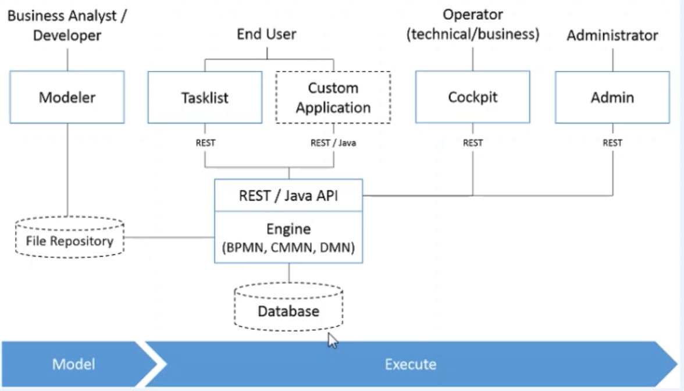

= Camunda BPM Beginners to Advance

== Links

- https://forum.camunda.org/[Forum Camunda]
- https://github.com/camunda[Git Camunda]
- https://github.com/camunda/camunda-bpm-examples[Git Camunda Examples]
- https://camunda.com/blog[Camunda Blog]
- https://docs.camunda.org[Camunda Docs]
- https://emsbach.medium.com/the-best-free-plugins-for-camundas-bpmn-2-modeler-14eee0c9fdd2[The best free Plugins for Camunda’s BPMN 2 Modeler]
- https://start.camunda.com/[Camunda Spring Initializr]
- https://docs.camunda.io/docs/components/best-practices/modeling/naming-bpmn-elements/[Naming Conventions]
- https://demo.bpmn.io/[BPMN IO Web]
- https://reqres.in/[Request Rest APIs Samples]

== Introduction of BPM

. BPMN stands for Business Process Model and Notation
. Specification of OMG (Object management Group)
. Graphical representation for specifying business processes in a business process model
. Process models describe sequences of business activities from start
. BPMN helps to graphically visualize business process which can be understood by all business stakeholders
. BPMN fills the gap among the various type of users, a bridge is always needed when it comes to business process design and implementation
. Business Analyst responsible for to understand and create the process
. Technical Developer responsible for implementing them by using some programming language
. Business Managers they are responsible to monitor the entire business and manage them

== Camunda Introduction

. Camunda BPMN is a implementer of BPMN 2.0 spec
. Camunda BPMN is a light-weight and open source platform for BPM
. Camunda is a Java-based framework

== Camunda Ecosystem

.Camunda Ecosystem

.Camunda Community vs Enterprise Edition
[cols="1,1,2"]
|===
|Edition Comparison |Community |Enterprise
|Engine,Modeler | Yes | Yes
|Web Apps: Cockpit, Tasklist, Admin | Yes | Yes
|Optimize (Reporting, Alerting, Analytics) | No | Yes
|Contractual Warranty | No | Yes
|SLA (24x7) | No | Yes
|Patch release for future | No | Yes
|Consulting and Training Service | No | Yes
|===

== BPMN Modeling

- Participants
. Pool
. Lane

- Activities
. Task
. Subprocess
. Call Activity
. Adhoc
. Event Subprocess

- Gateways
. Exclusive (XOR)
. Parallel (AND)
. Inclusive (OR)
. Event-based

- Events
. Message
. Timer
. Error
. Conditional
. Signal
. Termination
. Link
. Compensation
. Multiple
. Parallel
. Escalation

== Events in Camunda

=== Message start

[source,bash]
----
curl http://localhost:8080/engine-rest/message
----

.Message Start Event Sample used on the Postman message name must combine with, Message name in Camunda modeler
[source,json]
----
{
    "messageName": "Message_Start",
    "businessKey": "320",
    "processVariables": {
        "question": {
            "value": "What's a cockpit",
            "type": "String"
        }
    }
}
----

=== Signal Interrupting

[source,bash]
----
curl http://localhost:8080/engine-rest/signal
----

.Signal Interrupting
[source,json]
----
{
    "name": "GoHomeAlert",
    "variables": {
        "alertType": {
            "value": "High"
        }
    }
}
----

== Task Type

. Service Task
. User Task
. Script Task - supported languages are Groovy, Javascript, JRuby and Jython
. Send and Receive Task
. Business Task

=== External Script

. in folder src/main/resources/scripts/request.groovy
. in bpmn script task choose external resource and link the folder up above such (scripts/request)

=== Service Tasks

. Service Task is used to invoke services, in camunda this is done by calling Java code or providing a work item for an external worker in async mode

=== Send and Receive Tasks

. Send task is a mainly to send a message with Java code
. A Receive Task is a wait state in element/activity, waiting for a arrival of certain message

=== Gateways

. Gateways are BPMN flow elements, which are used to control how sequence flows interact as they converge and diverge with a processes, enabling implementation of branching, forking, merging and connection of ways in a business methods, allowing modeling decisions based on data and events as well as fork/join concurrency

- Exclusive Gateway only one patch of execution is possible like (if/else)
- Inclusive Gateway allow multiple condition follow ahead with the execution
- Parallel Gateway don't have condition in the sequence and allow the flow get executed
- Event-Based Gateway the flow will get executed when an event occurs, such a timer, message etc

=== Pool and Lane

- Pool contains flow objects vertically or horizontally
- Lane helps to organize and categorize activities within a pool
- Pool Collaboration??(miss a more detailed class)

=== Subprocess

- Organize the processes to be more readable flows, but generate multiples ids on db

=== Error Handling

- Business or Technical Errors

=== Service API

- Runtime Service
- Task Service
- History Service
- Repo Service

=== Database in Camunda

- http://localhost:8080/h2/h2[H2 Camunda Link]
- https://docs.camunda.org/manual/7.15/user-guide/process-engine/database/database-schema/[Database Schema Camunda]

=== Task forms

- Can be used by Start Event and User Task
- Embedded Task forms is a html-based form
- Generated Task forms generated from xml metadata
- External Task forms user is redirected to another application to complete the task
- Generic Task forms generic task form will be generated in case of no pre-exists task

=== Decision Model and Notation (DMN)

- Specification of popular group OMG
- Helps to reduce multiple if-else in BPMN
- Provides tabular way to write business rules
- Easy for Business Analyst to define business rule

.DMN Restful endpoint invocation
- http://localhost:8080/engine-rest/decision-definition/key/{{dmn_name}}/evaluate

.Request for DMN
[source,json]
----
{
    "variables": {
        "provider": {
            "value": "AWS",
            "type": "string"
        },
        "edition": {
            "value": "Enterprise",
            "type": "String"
        }
    }
}
----

==== Hit policy

- Hit policy specifies how many rules of a decision table can be satisfied and which of the satisfied rules are included in the _decision table result_

- The hit policies is Unique, Any and First will always return a maximum of one satisfied rule.
The hit polices Rule Order and Collect can return multiple satisfied rules

=== JUnit with Camunda Code

- Camunda supports JUnit v3 and v4

[source,java]
----
// class level
class ProcessUnitLevel {
@Rule
@ClassRule
static ProcessEngileRule processEngileRule = TestCoverageProcessEngileRuleBuilder.create().build();
  @Test
@Deployment(resources="process.bpmn")
public void testParsingAndDeployment() {

var runtime = processEngileRule.getRuntimeService();
var pi = runtime.startProcessInstanceByKey("instance-id");

var taskService = processEngileRule.getTaskService();
var task = taskService.createTaskQuery().singleResult();
}
}
----

https://reqres.in/api/users

https://reqres.in/api/users?page=2